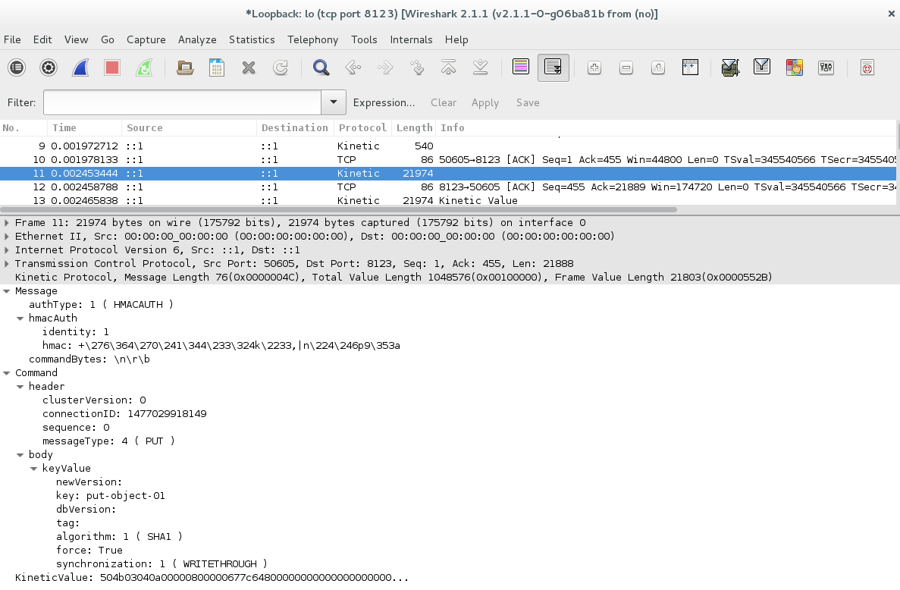

Introduction
=====================

Generating Wireshark plugins for Kinetic Protocol

This plugin code base was generated by [protobuf-wireshark](https://github.com/chrisdew/protobuf-wireshark). With additional changes for Kinetic Protocol:

1. Corrected some API calls and enum definition to make the code compilable for new version of wireshark
2. Make the plugin decode TCP packages
3. Make the plugin decode 2 top-level messages: `com::seagate::kinetic::proto::Message` and `com::seagate::kinetic::proto::Command`

Version Information: 
------------------------

Kinetic Protocol : [Kinetic Protocol 3.1.0](https://github.com/Kinetic/kinetic-protocol/blob/master/kinetic.proto)

Wireshark : 2.1.1



Build Instruction
================

NOTATION
--------------------

* WSRC_DIR      :   Directory containing the wireshark source code (wireshark-2.1.1 by default)
* WINSTALL_DIR  :   Directory into which wireshark is installed.
* CURR_DIR      :   This directory - containing this README file and make_wireshark_plugin.py

STEP 1: Install Wireshark from source
-------------------------------------

1. Download and unzip wireshark.  (Tested with wireshark-2.1.1)
2. $ cd WSRC_DIR
3. $ ./autogen.sh 
4. $ ./configure --prefix=WINSTALL_DIR --with-plugins
5. $ make install  (This will take a while)
6. WINSTALL_DIR/bin contains the wireshark you just compiled.  Start it up and make sure it works fine.

Step 2: Prepare Kinetic Protocol Buffers
-------------------------------------

Run `protoc` on the `kinetic.proto` file to generate `kinetic.pb.cc` and `kinetic.pb.h`. 

    $protoc --cpp-out=. kinetic.proto

Refer `protoc` documentation.  We assume that libprotobuf is installed in a well-known
location.

Step 3: Create plugin configuration file
-------------------------------------

Example: kinetic.conf

````
name                  : kinetic
proto_file            : /data/github/kinetic-wireshark/kinetic.proto
wireshark_src_dir     : /data/github/wireshark-2.1.1
wireshark_install_dir : /home/username/wireshark
wireshark_version     : 2.1.1
````

* name                   :   The name of this plugin.
* proto_file             :   Absolute path to all .proto files
* wireshark_src_dir      :   Absolute path to the wireshark source files directory, i.e., WSRC_DIR
* wireshark_install_dir  :   Absolute path to the directory in wireshark is installed, i.e., WINSTALL_DIR
* wireshark_version      :   1.0.2 or whatever other version you are using


Step 4: Run make_wireshark_kinetic.py
-------------------------------------

1. $ cd CURR_DIR
2. $ ./make_wireshark_kinetic.py kinetic.conf
3. Watch out for any errors.

Step 5: Done
-------------------------------------

1. Start wireshark and check if kinetic shows in "Analyze >> Enabled Protocls" menu.
2. Send some TCP packets with kinetic in the payload.
3. Check if they are correctly decoded.
4. If not, try forcefully decoding as "kinetic" using the "Decode As" popup menu item.
5. If it still does not work, please email the author.
